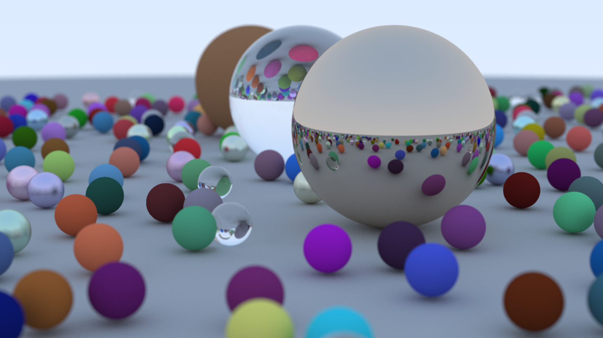

# 🌌 Ray Tracer from Scratch

A simple yet powerful ray tracer written in C++, built from the ground up using only the standard library. This project renders 3D scenes with realistic lighting, reflections, shadows, and materials like metal and glass. it follows the guide of ["Raytracing in one weekend"](https://raytracing.github.io/books/RayTracingInOneWeekend.html) 

## 📖 Overview

This renderer uses ray tracing to simulate how light interacts with objects in a scene. It supports:

- Ray-sphere intersections
- Diffuse and specular materials
- Reflection and refraction
- Depth of field
- Procedural camera system

## ✨ Features

- ✅ Recursive ray tracing
- ✅ Lambertian, metal, and dielectric materials
- ✅ Basic shadows and global illumination
- ✅ Configurable camera and scene
- ✅ Outputs `.ppm` image files

## 🛠️ Built With

- **Language:** C++
- **Build System:** CMake
- **Output Format:** PPM (can be converted to PNG/JPG with tools like `ffmpeg` or `ImageMagick`)

## To Run it

    1. Clone the repo
    2. Make sure you have installed [!CMAKE](https://cmake.org/)
    3. Run "build_and_run.ps1" if you are on windows, otherwise lookup equivalent CMAKE commands of your platform
    4. The image output will be in ppm, you can adjust the samples per pixel and the resolution of the final image at the cam properties of **main.ccp**

## Example Image

This is with a camera width of "1200px" and 500 samples per pixel. It took over 30 mins to generate. play with the numbers and see the difference!

