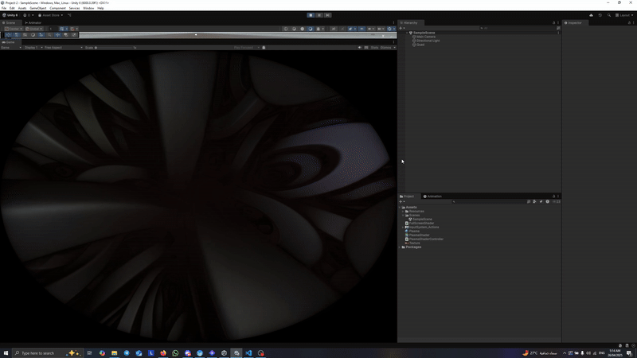

# 🎮 ShaderToy to Unity GLSL Conversion

This project demonstrates how to convert a shader from [ShaderToy](https://www.shadertoy.com/view/ldfGWn) (HLSL) into a Unity-compatible GLSL shader.

## ✨ Original Shader

**Title:** Rays in the Clouds  
**Author:** Shane  
**ShaderToy Link:** [https://www.shadertoy.com/view/ldfGWn](https://www.shadertoy.com/view/ldfGWn)

## 🔄 Project Goal

The goal is to recreate the shader from ShaderToy inside Unity, using Unity’s ShaderLab and GLSL (via `#pragma glsl` or compatible syntax), ensuring visual fidelity and real-time performance.

## To Run It
    
    1. Clone the repo
    2. Import it as a project in Unity 6
    3. Run in unity

## 📸 Final Result

