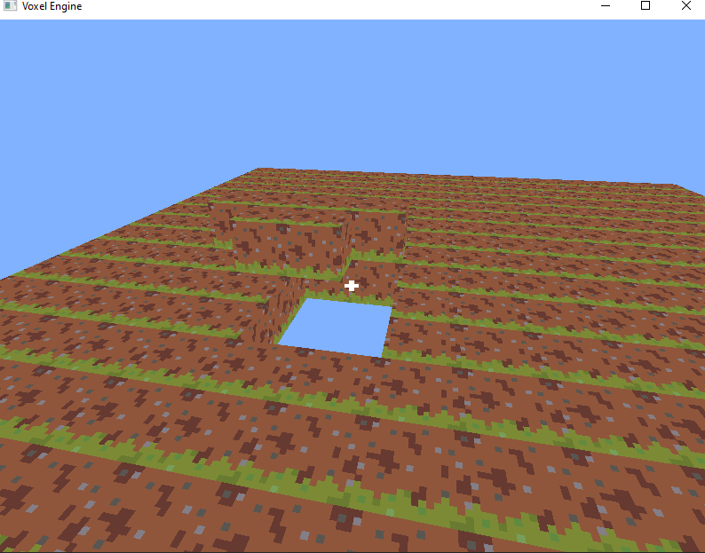

# Block Placement and Destruction in 3D Game Engine

This project implements a basic 3D game engine where players can place and destroy blocks within a chunk-based world. The engine features raycasting to detect blocks in the world and allows interaction through mouse inputs (left and right click) to place or destroy blocks. It also integrates a simple camera system to navigate the world.
Features

    Block Interaction: Players can destroy and place blocks using mouse inputs.

        Left Mouse Button: Destroys the block that the raycast hits.

        Right Mouse Button: Places a block adjacent to the hit position.

    Raycasting: The engine uses raycasting to detect the first non-air block in the world, enabling block interactions.

    Camera System: A first-person camera system that allows players to move around and look around the world.

    Chunk-based World: The world is split into chunks, with blocks organized in a 3D grid.

## Requirements

    Java: JDK 17 or later

## To Run It

    1. Clone the Repository or download the jar directly from "build/libs/your-project-name.jar"
    2. run the command "java -jar build/libs/Project-3.jar" or "java -jar Project-3.jar" depending on step 1

This should start the game window with a simple 3D environment where you can interact with blocks.

## Controls

    W: Move forward

    S: Move backward

    A: Move left

    D: Move right

    Mouse: Look around

    Left Mouse Button: Destroy block at the raycast hit position

    Right Mouse Button: Place a block adjacent to the raycast hit position

    ESC: Closes the window

## Known Issues

    Placement of blocks may not work correctly in all cases (e.g., placing blocks inside another block).

## Example Screenshot

