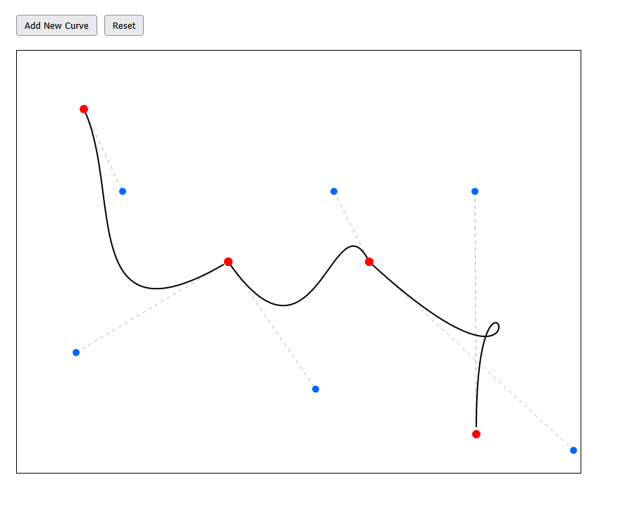

# Bezier Curve Editor

This project showcases an implementation of a cubic bezier curve editor, where you can move the anchor points, control points, and add more curves to create the ultimate curve.

## To Run It
    
    1. Clone the repo
    2. Open the HTML file in a browser of your choice
    3. Enjoy

## 📸 Example Screenshot

