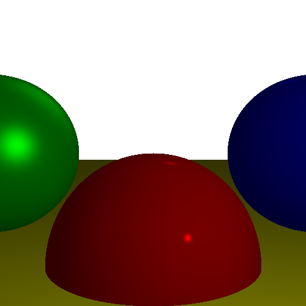

Ray Tracing Project

This repository implements a simple ray tracing algorithm to render a 2D scene using Python. It generates an image based on the pseudo-code provided in Chapter 2 of "Ray Tracing in One Weekend." The goal is to create a raw graphics application that draws pixels on a canvas.

Features

Implements ray-sphere intersection to render 2D spheres.

Generates a simple scene with red, green, and blue spheres.

Outputs the rendered image as output.png.

Requirements

Python 3.x

Libraries:

numpy

Pillow

Setup Instructions

Clone the Repository:

git clone <https://github.com/omar-omair/ICS415-R1.git>
cd <ICS415-R1>

Install Dependencies:

pip install -r requirements.txt

Run the Program:

python ray_tracing.py

Output:

The generated image will be saved in the repository as output.png.

Compatibility

This project is fully compatible with the following operating systems:

Windows: Ensure Python and pip are installed and accessible via the command prompt.

macOS: Use the Terminal to run commands.

Linux: Compatible with most distributions; use your package manager to install Python if needed.

Example

